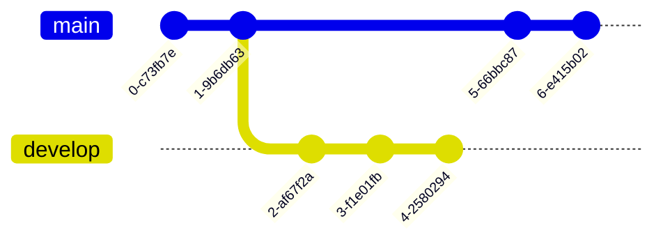
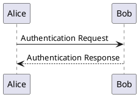

# frontend-practice

## mermaid integration

```mermaid
    gitGraph
       commit
       commit
       branch develop
       commit
       commit
       commit
       checkout main
       commit
       commit

```

## plantuml integration

```plantuml
@startuml
    Alice -> Bob: Authentication Request
    Bob --> Alice: Authentication Response
@enduml
```
